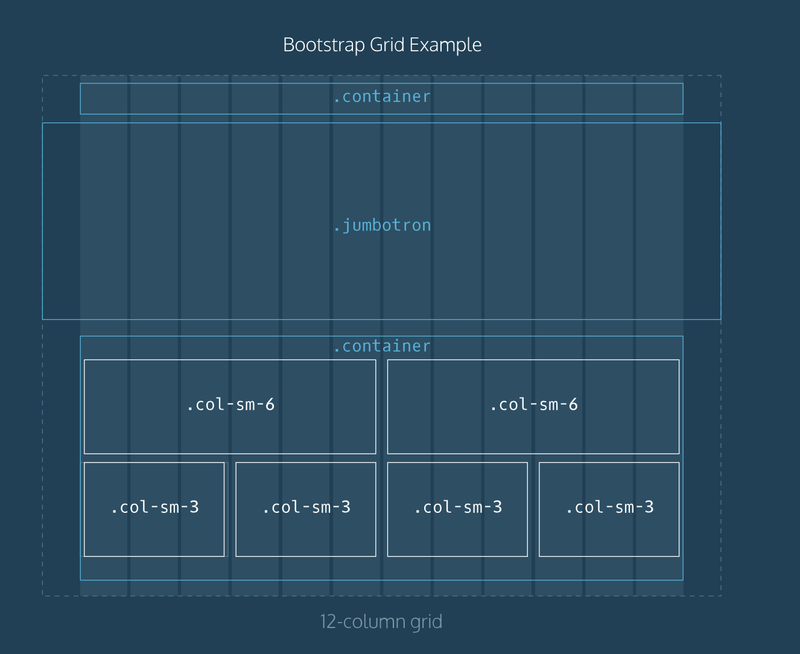

---
layout: post
title: "My notes for html&css 2"
date: 2017-03-13 
description: "My notes for html&css 2"  

tag: BLOG 
---   
    This is my notes for html&css.

## CONTENT：
+   CSS    
    ----CSS Box Model:content,padding,border,margin    
    Every page element has boundary and space properties: content,padding,border,margin.   
    The border property's value requires three parts:   
    1.thickness;   
    2.type:solid,dotted,and dashed;   
    3.color   
    e.g.   
    .page-description {    
        padding:30px;
        border: 1px solid #000;
        text-align: center;
    }    
    .answer {    
    margin: 2rem;    
    } //Ensure 2rems of space between elements with the class answer and surrounding page elements.    
    Additional margin properties:   
    1.margin-top    
    2.margin-bottom    
    3.margin-left           
    4.margin-right   

    ----display    
    1.display:block    
    2.display:inline    
    
    ----float:right or left    
    #search-bar{    
        float:right
    }
    
    ----align actions    
    .parent {           
        display: flex; //align elements in parent horizontally;    
        flex-wrap: wrap; //make sure no child element moves off the page    
        justify-content: center;    
     }      
    ----position:relative     
    .container{    
        position:relative;          
        top: 10px;//move it 10px away from the up          
        left: 20px;//move it 20px away from the left           
    }//once position is set to relative, top,bottom,left and right can be used to repostion HTML    
    
+   Bootstrap    
    Bootstrap is a popular CSS framework with prewritten CSS rules designed to help you build webpages faster.    
    Bootstrap offers grids. The Bootstrap grid contains 12 equal-sized columns.    

----Details    
    .container .jumbtron .col-sm-6 .col-sm-3 refer to Bootstrp classes.
    Jumbtron spans the entire width of the webpage,beyond the borders of the grid.    
    
     
+   references:  
    https://www.codecademy.com  
    

