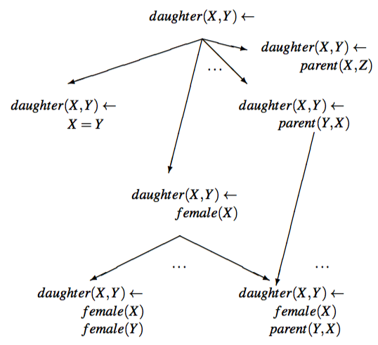

---  
tag: AI 
---
## Horn Clause

Horn clause: a clause(a disjunction of literals) with at most one positive literal.     
A Horn clause with exactly one positive literal is a definite clause.     
A Horn clasue with no positive literals is called a goal clause, especially in logic programming.    
A Horn formula is a conjunctive normal form formula whose clauses are all Horn; that is, it is a conjunction of Horn clauses.      
A definite Horn clause:    
$\lnot p \lor \lnot q \lor ...\lor \lnot t \lor u$    
=$\lnot(p \land q \land  ...\land  t) \lor u$     
=$(p \land q \land  ...\land  t) \to u$

The resolution of two Horn clauses is a Horn clause.    
The resolution of a goal clause and a definite clause is again a goal clause.
In automated theorem proving, this can lead to greater efficiencies in proving a theorem(represented as a goal clause).

## Logic programs

Logic programs consist of clauses. The conclusion part of a clause is termed the head and the condition part the body of the clause.    
The head and boy of a clause consist of atoms.    
An atom being a predicate applied to some arguments, which are called terms.    
a gound term: a term that does not contain any free variables.    
E.G.    
$father(X,Y) \lor mother(X,Y) \Leftarrow parent(X,Y)$    
$parent(X,Y)$ is body of clause.    
$father(X,Y) \lor mother(X,Y)$ is the head.     
$parent, father, mother$ are predicates.    
$X, Y$ are variables.    
$father(X,Y), mother(X,Y), parent(X,Y)$ are atoms.    
In PROLOG, variables in clauses are implicitly universally quantified.  
Clauses are also view as sets of literals. A literal is an atom or its negation: $father(X,Y) \lor mother(X,Y) \lor \lnot parent(X,Y)$

$\textbf{definite clauses}$ contain exactly one atom in the head:    
$ancestor(X,Y) \Leftarrow parent(Z,Y) \land ancestor(X,Z)$, which also a recursive clause.        
$\textbf{full clauses}$:    
$father(X,Y) \lor mother(X,Y) \Leftarrow parent(X,Y)$    
$\textbf{program clauses}$ can contain negated atoms:     
$mother(X,Y) \Leftarrow parent(X,Y) \land \lnot male(X)$     

## ILP
Inductive logic programming is concerned with inductive inference. It generalizes from individual instances/observations in the presence of background knowledge, finding regularities or hypotheses about yet unseen instances.    
From training examples, ILP then induces a logic program(predicate definition) corresponding to a view that defines the target relation in terms of other relations that are given as background knowledge.    

### The Problem Specification

Given is a set of examples, positive examples and negative examples.     
Given are also background relations.     
Finally, a hypothesis language, specifying syntatic restrictions on the definition of p is also given.   
The task is to find a definiton of the target relation p that is consitent and complete, i.e., explains all the positive and none of the negative tuples.     
$ E = P \cup N, B$    
The task is to find a hypothesis H such that $\forall e \in P: B \land H \vDash e$(H is complete) and $ \forall e \in N: B \land H \nvDash e$(H is consistent)

### A Common Aprroach
Use a greedy covering algorithm     
Repeat while some posititive examples remain unvovered(not entailed):    
    - Find a good clause(one that covers as many positive examples as possible but no/few nagatives)
    - Add that clause to the current theory, and remove the positve examples that it covers.

ILP algorithms use this apprach but vary in thir method for $\textbf{finding a good clause}$.       

In a main loop, a covering algorithm constructs a set of clauses.     
Starting from an empty set of clauses,
    - it constructs a clause explaining some of the positive examples    
    - adds this to the hypothesis, and removes the positive exaples explained    
Repeat untill all positive examples have been explained.(The hypothesis is complete.)     

In the inner loop of the covering algorithm, individual clauses are constructed by (heuristically) searching the space of possible clauses, structured by a specialization or generalization operator.

### Structuring the space of clauses
In order to search the space of relational rules systematically, it is useful to impose some structure upon it, e.g., an ordering. One such ordering is based on $\theta$-subsumption.

A substitution $\theta$ = {$V_1/t_1,..., V_n/t_n$} is an assignment of terms $t_i$ to $V_i$. Applying a substitution $\theta$ to a term, atom, or clause F yields the instantiated term, atom, or clause $F\theta$.    
Let c and c' be two program clauses.    
Clause c $\theta$-subsumes c' if there exists a substitution $\theta$ that can be applied to c, such that $c\theta \subseteq c'$      

Example:      
Clause c = $daughter(X,Y)\leftarrow parent(Y,X)$    
Clause c' = $daughter(mary,ann) \leftarrow parent(ann, mary), female(mary), parent(ann,tom)$     

Applying the substitution $\theta$ = {X/mary, Y/ann} to c yields    
$c\theta$ = $daughter(mary,ann)\leftarrow parent(ann,mary)$    
Clauses can be viewed as sets of literals:      
the clausal notation, $daughter(X,Y)\leftarrow parent(Y,X)$ thus stands for {daughter(X,Y), $\lnot$parent(Y,X)} where all variables are assumed to be universally quantified.    

$\theta$-subsumption introduces a syntactic notion for generality.    
Clause c is at least as general as c' if c $\theta$-subsumes c'($c\theta \subseteq c'$)    
if $c\theta \subset c'$ holds, but $c\theta \subseteq c'$ doesn't hold, then c is more general than c'.    
In this case, c is a generalization of c'. c' is a specialzation of c. c' is called a refinement of c.    
$c \vDash c'$ if c $\theta$-subsumes c'    
c is more general than c' if $c \vDash c'$    

$\theta$-subsumption introduces a lattice on the set of reduced clauses: this enables ILP systems to prune large parts of the search space.     
$\theta$-subsumption also provdes the basis for clause construction by to-down searching of refinement graphs and bounding the search of refinement graphs from below by using a bottom clause.

### Searching the space of clauses
$\textbf{A top-down manner}$: from general to specific hypotheses, using a $\theta$-subsumption-based specialization operator(a refinement operator).     
Given a hypothesis language L,     
a refinement operator P maps a clause c to a set of clauses p(c) which are specializations(refinements) of c:    
p(c) = {c'|c'$\in$ L, c < c'}

The hypothesis space of program clauses is a lattice, structured by the $\theta$-subsumption generality ordering.    
In this lattice, a refinement graph can be defined as a directed, asyclic graph in which     
nodes are program clauses and     
arcs correspond to the basic refinement operations:     
- substituting a variable with a term, 
- adding a literal to the body of a clause.

#### Refinement Graph(Lattice)

The task is to learn a definition of the daughter relation in terms of the relation female and parent.    

The refinement graph is typically searched heuristically level-wise, using heuristics based on the number of positive and negative examples covered by a clause.     
As the branching factor is very large, greedy search methods are typically applied which only consider a limited number of alternatives at each level.  Hill-climbing considers only one best alternative at each level, while beam search considers n best alternatives, where n is the beam width. Occasionally, complete search is used, e.g. A* best-first search or breadth-first search. This search can be found from below by using so-called bottom clauses, which can be constructed by least general generalization.    

Reference: Data Mining and Knowledge Discovery Handbook, Second Ediction
