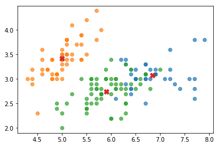
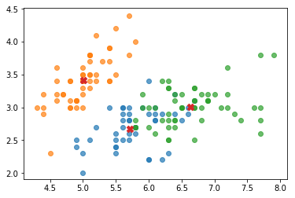

---  
tag: Clustering
---

In Kmeans++, the procedure for selecting the initial k points requires k passes over the data.     
Kmeans parallel is another randomized technique for selecting the initial k points. It takes significantly fewer passes over the data.      

# Algorithm

It has two major steps.     
In the first step, it computes a set U of more than k points.       
In the second step it selects exactly k points from U.

## The first step

Input: $x_1,...,x_n$, $l$: a value for the oversampling factor, $p$: number of passes.      
The authors recommend $l\approx {k \over 2}, p \approx 5$. The analysis requires $p\approx log(n)$    
Output: U containing approximately $l\times p$ points.   

- Select $u_1$ uniformly at random from $x_1,...,x_n$, Put $u_1$ in U.
- Iterate p times, with j = 1,...,p:    
    For each $x_i$     
    - compute $dist^2(x_i, U)$      
    $dist^2(x_i, U) = \min\limits_{u \in U}|x_i-u|^2$      
    - Compute the probability $p_i$ proportional to:$p_i \sim dist^2(x_i, U)$
    - Select at random $l$ points from this distribution and add them to U.
    

## The second step
Input:$x_1,...,x_n$, U containing approximately $l\times p$ points, k.     
Output:$u_1,...,u_k$      
- For each $u_j$ in U compute the weight $w_j$ defined as follows:    
$w_j$ = number of points $x_i$ that are closest to $u_j$
- Run weighted kmeans++ on the weighted points in U to select $u_1,...,u_k$

# Implementation


```python
def randomInt(low, high, size):
    '''
    return a list with all values are integers, no repeating, and with len equals to size.
    '''
    import numpy as np
    ret = []
    while(len(ret) < size):
        v = np.random.randint(low, high)
        if v not in ret:
            ret.append(v)
    return ret

def convertSoftToHardClustering(C, n, k):
    '''
    C: is a dictionary. {(0, 2): 0.9, ...} means x_0 belongs to class 2 with possibility 0.9
    n is number of points in data
    k is the number of Clusters
    '''
    import numpy as np
    
    Labels = []
    for i in range(n):
        possible_class = {}
        for j in range(k):
            possible_class[j]= C.get((i,j), 0) 
            
#         print('possible_class for ', i, possible_class)
        
        import operator
        final_c = max(possible_class.items(), key=operator.itemgetter(1))[0]
        final_c += 1
        
        Labels.append(final_c)
    return Labels

def normalizeP(P):
    '''
    P is a list
    '''
    Z = sum(P)
    posibilities = [item/Z for item in P]
    return posibilities
```


```python
def Kmeans(Xt, k, r, initialFun=None, givenU=None):
    '''
    Xt: a row is a point
    k: number of clustering
    r: iterations
    '''
    DEBUG = False
    import numpy as np
    
    n,m = Xt.shape # n is number of points
    C = {} #{(0, 0): 1, ...} means x_0 belongs to class 0
    
    for iteration in range(r):
        if DEBUG: print('----iteration:', iteration)
        # 1. U
        U = [] #[(5,1),...] means u_0 is (5,1)
        if (iteration == 0):
            # Select initial U
            if(givenU == None):
                U = initialFun(Xt, k)
            else:
                U = givenU
                
        else: # calulate U
            for j in range(k):
                sum_j = 0
                m_j = 0
                for i in range(n):
                    if C.get((i,j), 0) == 1:
                        sum_j += Xt[i,:]
                        m_j += 1
                U.append(tuple(sum_j/m_j))
        if DEBUG: print('U:', U)
                
        
        # 2. C
        # 2.1 calculate distances |x_i - u_j|^2
        
        #[[26.0, 36.0], ...] the first one means the distance of x_0 to all u_j in U
        D = []
        for i in range(n):
            ds = []
            for u in U:
                d = sum((Xt[i,:] - u)**2)
                ds.append(d)
            D.append(ds)
        if DEBUG: print('D:', D)
        
        # 2.2 assign class
        C = {}
        for i in range(len(D)):
            j = np.argmin(D[i])
            C[i,j] = 1
        if DEBUG: print('C:', C)
            
    # convert C into labels
    L = convertSoftToHardClustering(C, n, k)
    E = sum([min(d) for d in D])
#     print('labels:', L)
    print('E:', E)        
    return (L,U)
```


```python
def initalstepforLloyd(Xt, k):
    U = []
    n,m = Xt.shape # n is number of points
    idx = randomInt(0, n, k)
    for i in idx:
        U.append(Xt[i,:])
    return U
    
def initalstepforKmeansPP(Xt, k, W = None):
    '''
    Xt: a row is a point
    k: the number of clusters
    here, k means that we need to choose len(U) = k
    '''
    
    n,m = Xt.shape # n is number of points
    
    #Select u_0
    idx = randomInt(0, n, 1)
    U = [Xt[j,:] for j in idx]
    
    # Select u_1,...u_{k-1}
    for j in range(1,k):
        # calculate the P
        P = []
        for i in range(n):
            # calculate distance of each x_i to U
            ds = []
            for u in U:
                d = sum((Xt[i,:] - u)**2)
                ds.append(d)
            posi = min(ds)
            if(W != None):
                posi = W[i]*posi
            P.append(posi )
        P = normalizeP(P)
        #print(P)
        
        # select u_j
        idx_u_j = np.random.choice(n, 1, p=P)[0]
        U.append(Xt[idx_u_j,:])
            
    return U

def initalstepforKmeansParallelFirst(Xt, p, li):
    '''
    Xt: a row is a point.
    p: number of passes
    li: a value for the oversampling factor.
    '''
    
    n,m = Xt.shape # n is number of points
    
    #Select u_0
    idx = randomInt(0, n, 1)
    U = [Xt[j,:] for j in idx]
    
    # p passes, in each pass, select li points
    for j in range(p):
        # calculate the P
        P = []
        for i in range(n):
            # calculate distance of each x_i to U
            ds = []
            for u in U:
                d = sum((Xt[i,:] - u)**2)
                ds.append(d)
            P.append(min(ds))
        P = normalizeP(P)
        
        # select li points
        indexes = np.random.choice(n, li, p=P)
        for idx in indexes:
            U.append(Xt[idx,:])
    return U

def initalstepforKmeansParallelSecond(Xt, U1, k):
    '''
    U1: is obtained from the first step with len(U) >= k
    We use weighted KmeansPP to select k from U1
    '''
    import numpy as np
    
    # calculate weights
    L,U = Kmeans(Xt, len(U1), 1, givenU=U1)
    COUNTS = []
    # COUNTS: the number of points that are cloasest to u_j.
    # We can obtain this by Kmeans given U with one iteration.
    for j in range(1,len(U1)+1):
        COUNTS.append(L.count(j))
    W = normalizeP(COUNTS)
    
    # select k from U1
    U1 = np.array(U1)
    U = initalstepforKmeansPP(U1, k, W)
    return U

def initalstepforKmeansParallel(Xt, k, DEBUG=False):
    p = 5
    li = int(k/2)
    U1 = initalstepforKmeansParallelFirst(Xt, p, li)
    if(DEBUG):
        print('first U:', U1)
    U = initalstepforKmeansParallelSecond(Xt, U1, k)
    if(DEBUG):
        print('final U:', U)
    return U
    
```

# Evaluation


```python
def plotData(Xt):
    '''
    Xt: a row is a point
    '''
    import matplotlib.pyplot as plt
    fig, ax = plt.subplots()
    ax.scatter(Xt[:,0], Xt[:,1]) # first dimension and second dimension
    ax.axis('equal')
def plotClusters(Xt, L, U=None):
    '''
    Xt: a row is a point
    L: labels coresponding to Xt
    '''
    import matplotlib.pyplot as plt
    fig, ax = plt.subplots()
    ax.axis('equal')
    n,m = Xt.shape # n is number of points
    
    Group = []
    for j in range(k):
        group_j = []
        for i in range(n):
            if L[i] == (j+1):
                group_j.append(Xt[i,:])
        Group.append(group_j)
    for group in Group:
        g = np.array(group)
        ax.scatter(g[:,0], g[:,1], alpha=0.7)
    if (U!=None):
        U = np.array(U)
        ax.scatter(U[:,0], U[:,1], marker='X', s=70)
```


```python
# for test
# Load Data
import numpy as np
filename = "iris.data.txt"
Xt = np.genfromtxt(filename, delimiter=',', autostrip=True)
k = 2
print(Xt.shape)
```

    (150, 4)


```python
plotData(Xt)
```


<!--  -->


```python
k = 3
r = 5
U = initalstepforKmeansParallel(Xt, k, DEBUG=True)
```

    first U: [array([ 5.8,  2.6,  4. ,  1.2]), array([ 5.8,  4. ,  1.2,  0.2]), array([ 7.9,  3.8,  6.4,  2. ]), array([ 5.8,  2.7,  5.1,  1.9]), array([ 6.7,  2.5,  5.8,  1.8]), array([ 7.7,  3. ,  6.1,  2.3])]
    E: 122.0
    final U: [array([ 7.9,  3.8,  6.4,  2. ]), array([ 5.8,  2.6,  4. ,  1.2]), array([ 5.8,  4. ,  1.2,  0.2])]


```python
L,U = Kmeans(Xt, k, r, initialFun=initalstepforKmeansParallel)
plotClusters(Xt, L, U)
```

    E: 56.72
    E: 78.9408414261


<!--  -->


```python
L,U = Kmeans(Xt, k, r, initialFun=initalstepforKmeansPP)
plotClusters(Xt, L, U)
```

    E: 83.4796326389


<!--  -->


```python
L,U = Kmeans(Xt, k, r, initialFun=initalstepforLloyd)
plotClusters(Xt, L, U)
```

    E: 88.9203577274


<!--  -->


